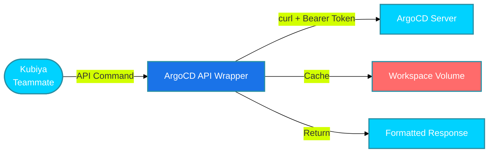

#  ArgoCD API Wrapper for Kubiya

<div align="center">

> 🚀 High-performance ArgoCD operations through Kubiya using curl

[](https://chat.kubiya.ai)
[](https://argo-cd.readthedocs.io/)
[](https://argo-cd.readthedocs.io/en/stable/developer-guide/api-docs/)

</div>

## 🎯 Overview

This module provides a high-performance ArgoCD API wrapper for Kubiya. Built with intelligent caching, workspace volumes, and optimized curl-based operations, this tool enables efficient management of ArgoCD applications, clusters, and repositories.

## 🏗️ How It Works



## ✨ Key Features

<table>
<tr>
<td width="50%">

### 🔧 Complete ArgoCD Management
- Application lifecycle management
- Cluster and repository operations
- Sync operations with advanced options
- Deployment history and rollbacks

</td>
<td width="50%">

### 🚀 High Performance
- Intelligent caching (15-30 min TTL)
- Workspace volume persistence
- Multiple output formats
- Efficient API usage

</td>
</tr>
<tr>
<td width="50%">

### 📊 Advanced Filtering
- Project-based filtering
- Health status filtering
- Sync status filtering
- Resource-specific operations

</td>
<td width="50%">

### 🔒 Secure & Reliable
- Bearer token authentication
- Containerized execution
- Error handling and retries
- Workspace data isolation

</td>
</tr>
</table>

## 📋 Prerequisites

<table>
<tr>
<td width="120" align="center">

<br/>ArgoCD
</td>
<td>

- ArgoCD server access
- API token with appropriate permissions
- Network connectivity to ArgoCD server
- Authentication configured

</td>
</tr>
<tr>
<td width="120" align="center">

<br/>Docker
</td>
<td>

- Docker runtime
- Container access
- Volume mounts
- Network access

</td>
</tr>
</table>

## 🚀 Quick Start

### 1️⃣ Configure ArgoCD Connection

```bash
export ARGOCD_SERVER="your-argocd-server.com"
export ARGOCD_TOKEN="your-api-token"
```

**Note:** The API uses Bearer token authentication: `Authorization: Bearer <token>`

### 2️⃣ Install Tools

1. Visit [chat.kubiya.ai](https://chat.kubiya.ai)
2. Navigate to teammate settings
3. Install ArgoCD API wrapper source
4. Configure credentials

### 3️⃣ Start Using

Example commands:
```
argocd_list_applications
argocd_get_application --app_name myapp
argocd_list_clusters
argocd_sync_application --app_name myapp
```

## 📚 High-Performance Commands

### Core Application Operations
- **`argocd_list_applications`** - Advanced application listing with filtering and pagination
- **`argocd_get_application`** - Detailed application information with resource trees
- **`argocd_sync_application`** - Application sync with advanced options
- **`argocd_application_history`** - Deployment history and rollback operations

### Infrastructure Management
- **`argocd_list_clusters`** - Cluster listing with health status
- **`argocd_list_repositories`** - Repository management with connection status
- **`argocd_workspace_manager`** - Cache and workspace management

### 🚀 Performance Features
- **Smart Caching** - 15-30 minute TTL with workspace persistence
- **Advanced Filtering** - Project, health, sync status filtering
- **Multiple Output Formats** - Table, JSON, compact, summary views
- **Workspace Volumes** - Persistent data storage in `/workspace/argocd-data`
- **Error Resilience** - Comprehensive error handling and retries

## 🔧 Performance-Optimized Examples

### Smart Application Management
```bash
# List applications with filtering and caching
argocd_list_applications --project_filter production --health_filter Healthy --output_format table

# Get detailed application info with resources
argocd_get_application --app_name my-app --include_resources true --output_format detailed

# Sync with advanced options
argocd_sync_application --app_name my-app --prune true --wait true
```

### Infrastructure Operations
```bash
# List clusters with health status
argocd_list_clusters --output_format summary

# List repositories by type
argocd_list_repositories --repo_type git --output_format table

# Application history and rollback
argocd_application_history --app_name my-app --limit 5 --output_format table
argocd_application_history --app_name my-app --action rollback --revision abc123
```

### Workspace Management
```bash
# Check workspace status
argocd_workspace_manager --action status

# View cache statistics
argocd_workspace_manager --action stats

# Clean old cache files
argocd_workspace_manager --action cleanup
```

### Advanced Use Cases
```bash
# Filtered application listing with caching
argocd_list_applications \
  --project_filter "prod,staging" \
  --health_filter "Healthy" \
  --output_format "summary" \
  --limit 100

# Comprehensive application analysis
argocd_get_application \
  --app_name "critical-service" \
  --include_resources true \
  --output_format "json" \
  --refresh true

# Safe sync with dry-run first
argocd_sync_application \
  --app_name "my-service" \
  --dry_run true \
  --prune true \
  --force false

# Production sync with monitoring
argocd_sync_application \
  --app_name "production-app" \
  --prune false \
  --wait true \
  --resources "Deployment/api,Service/api"
```

## 📊 Response Formats

All commands support multiple output formats:

- **table** - Human-readable tabular format
- **json** - Full JSON response for programmatic use
- **compact** - Condensed single-line format
- **summary** - Aggregated statistics and counts

## 🗂️ Workspace Structure

```
/workspace/argocd-data/
└── cache/                # API response cache
    ├── apps_*.json      # Application listings
    ├── clusters_*.json  # Cluster information
    ├── repos_*.json     # Repository data
    └── app_*.json       # Individual app details
```

## 🔒 Security Features

- **Bearer Token Authentication** - Secure API token authentication
- **Environment Variables** - Secure credential storage
- **Container Isolation** - Isolated execution environment
- **Workspace Volumes** - Secure data persistence
- **No CLI Dependencies** - Pure curl-based operations

## 📚 Learn More

<table>
<tr>
<td width="33%" align="center">

[](https://docs.kubiya.ai)

</td>
<td width="33%" align="center">

[](https://argo-cd.readthedocs.io/)

</td>
<td width="33%" align="center">

[](https://argo-cd.readthedocs.io/en/stable/developer-guide/api-docs/)

</td>
</tr>
</table>

---

<div align="center">

Built with ❤️ by the [Kubiya Community](https://chat.kubiya.ai)


</div>