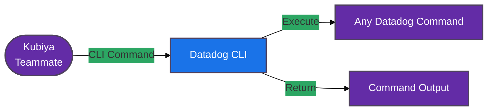

#  Datadog CLI Tools for Kubiya

<div align="center">

> 🚀 Direct Datadog CLI command execution through Kubiya

[](https://chat.kubiya.ai)
[](https://www.datadoghq.com/)
[](https://docs.datadoghq.com/cli/)

</div>

## 🎯 Overview

This module provides a direct CLI wrapper for Datadog commands through Kubiya. Built on Docker containers and leveraging the power of the Kubiya platform, this tool enables direct execution of any Datadog CLI command with full access to all Datadog features and capabilities.

## 🏗️ How It Works



## ✨ Key Features

<table>
<tr>
<td width="50%">

### 🔧 Universal CLI Access
- Execute any Datadog CLI command
- Full command-line functionality
- Direct access to all features
- Real-time command execution

</td>
<td width="50%">

### 🚀 Seamless Integration
- Native Datadog CLI experience
- Command validation
- Error handling
- Output formatting

</td>
</tr>
<tr>
<td width="50%">

### 📊 Complete Control
- Monitor management
- Dashboard operations
- Log management
- Infrastructure monitoring

</td>
<td width="50%">

### 🔒 Secure Execution
- Containerized environment
- Isolated execution
- API key authentication
- Environment variable support

</td>
</tr>
</table>

## 📋 Prerequisites

<table>
<tr>
<td width="120" align="center">

<br/>Datadog
</td>
<td>

- Datadog account
- API key and Application key
- CLI access
- Appropriate permissions

</td>
</tr>
<tr>
<td width="120" align="center">

<br/>Docker
</td>
<td>

- Docker runtime
- Container access
- Volume mounts
- Network access

</td>
</tr>
</table>

## 🚀 Quick Start

### 1️⃣ Configure Datadog Connection

```bash
export DD_API_KEY="your-api-key"
export DD_APP_KEY="your-application-key"
export DD_SITE="datadoghq.com"
```

### 2️⃣ Install Tools

1. Visit [chat.kubiya.ai](https://chat.kubiya.ai)
2. Navigate to teammate settings
3. Install Datadog CLI tools source
4. Configure credentials

### 3️⃣ Start Using

Example commands:
```
"monitor list"
"dashboard list"
"logs list"
"host list"
"service list"
```

## 📚 Available Commands

The Datadog CLI wrapper supports all standard Datadog CLI commands:

### Monitor Commands
- `monitor list` - List monitors
- `monitor show <monitor-id>` - Show monitor details
- `monitor create` - Create a new monitor
- `monitor update <monitor-id>` - Update a monitor
- `monitor delete <monitor-id>` - Delete a monitor

### Dashboard Commands
- `dashboard list` - List dashboards
- `dashboard show <dashboard-id>` - Show dashboard details
- `dashboard create` - Create a new dashboard
- `dashboard update <dashboard-id>` - Update a dashboard
- `dashboard delete <dashboard-id>` - Delete a dashboard

### Log Commands
- `logs list` - List log pipelines
- `logs show <pipeline-id>` - Show pipeline details
- `logs create` - Create a new pipeline
- `logs update <pipeline-id>` - Update a pipeline

### Host Commands
- `host list` - List hosts
- `host show <host-id>` - Show host details
- `host mute <host-id>` - Mute a host
- `host unmute <host-id>` - Unmute a host

### Service Commands
- `service list` - List services
- `service show <service-name>` - Show service details

## 📚 Learn More

<table>
<tr>
<td width="33%" align="center">

[](https://docs.kubiya.ai)

</td>
<td width="33%" align="center">

[](https://docs.datadoghq.com/)

</td>
<td width="33%" align="center">

[](https://chat.datadoghq.com/)

</td>
</tr>
</table>

---

<div align="center">

Built with ❤️ by the [Kubiya Community](https://chat.kubiya.ai)


</div> 