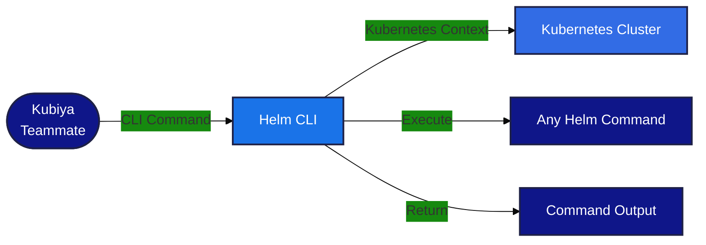

#  Helm CLI Tools for Kubiya

<div align="center">

> 🚀 Direct Helm CLI command execution through Kubiya

[](https://chat.kubiya.ai)
[](https://helm.sh/)
[](https://helm.sh/docs/)

</div>

## 🎯 Overview

This module provides a direct CLI wrapper for Helm commands through Kubiya. Built on Docker containers and leveraging the power of the Kubiya platform, this tool enables direct execution of any Helm CLI command with full access to all Helm features and capabilities. The tool automatically injects Kubernetes context for seamless cluster operations.

## 🏗️ How It Works



## ✨ Key Features

<table>
<tr>
<td width="50%">

### 🔧 Universal CLI Access
- Execute any Helm CLI command
- Full command-line functionality
- Direct access to all features
- Real-time command execution

</td>
<td width="50%">

### 🚀 Seamless Integration
- Native Helm CLI experience
- Command validation
- Error handling
- Output formatting

</td>
</tr>
<tr>
<td width="50%">

### 📊 Complete Control
- Chart management
- Release operations
- Repository management
- Kubernetes deployment

</td>
<td width="50%">

### 🔒 Secure Execution
- Containerized environment
- Isolated execution
- Automatic Kubernetes context injection
- Service account authentication

</td>
</tr>
</table>

## 📋 Prerequisites

<table>
<tr>
<td width="120" align="center">

<br/>Helm
</td>
<td>

- Helm CLI installed
- Kubernetes cluster access
- Service account with appropriate permissions
- Cluster-admin or namespace-specific RBAC

</td>
</tr>
<tr>
<td width="120" align="center">

<br/>Kubernetes
</td>
<td>

- Kubernetes cluster running
- Service account token available
- Cluster CA certificate accessible
- Network connectivity to cluster

</td>
</tr>
<tr>
<td width="120" align="center">

<br/>Docker
</td>
<td>

- Docker runtime
- Container access
- Volume mounts
- Network access

</td>
</tr>
</table>

## 🚀 Quick Start

### 1️⃣ Kubernetes Context Setup

The tool automatically injects Kubernetes context using service account credentials:

```bash
# The tool automatically handles:
# - Service account token injection
# - Cluster CA certificate setup
# - kubectl context configuration
# - Helm cluster connectivity
```

### 2️⃣ Install Tools

1. Visit [chat.kubiya.ai](https://chat.kubiya.ai)
2. Navigate to teammate settings
3. Install Helm CLI tools source
4. Ensure Kubernetes service account is configured

### 3️⃣ Start Using

Example commands:
```
"list"
"install my-release ./chart"
"upgrade my-release ./chart"
"uninstall my-release"
"repo add bitnami https://charts.bitnami.com/bitnami"
```

## 🔧 Kubernetes Context Injection

The Helm CLI tool automatically handles Kubernetes context setup:

### Automatic Setup
- **Service Account Token**: Automatically mounts from `/var/run/secrets/kubernetes.io/serviceaccount/token`
- **Cluster CA Certificate**: Automatically mounts from `/var/run/secrets/kubernetes.io/serviceaccount/ca.crt`
- **Context Configuration**: Sets up in-cluster context using kubectl
- **Helm Integration**: Helm automatically uses the configured kubectl context

### Required Permissions
The service account needs appropriate RBAC permissions:
```yaml
apiVersion: rbac.authorization.k8s.io/v1
kind: ClusterRole
metadata:
  name: helm-cli-role
rules:
- apiGroups: [""]
  resources: ["pods", "services", "configmaps", "secrets"]
  verbs: ["get", "list", "watch", "create", "update", "patch", "delete"]
- apiGroups: ["apps"]
  resources: ["deployments", "statefulsets", "daemonsets"]
  verbs: ["get", "list", "watch", "create", "update", "patch", "delete"]
```

## 📚 Available Commands

The Helm CLI wrapper supports all standard Helm CLI commands:

### Release Commands
- `list` - List releases
- `install <release-name> <chart>` - Install a chart
- `upgrade <release-name> <chart>` - Upgrade a release
- `uninstall <release-name>` - Uninstall a release
- `rollback <release-name> <revision>` - Rollback a release
- `status <release-name>` - Show release status
- `get values <release-name>` - Get release values
- `get manifest <release-name>` - Get release manifest

### Chart Commands
- `package <chart-directory>` - Package a chart directory
- `show chart <chart>` - Show chart information
- `show values <chart>` - Show chart values
- `show readme <chart>` - Show chart README
- `lint <chart>` - Lint a chart
- `template <release-name> <chart>` - Template a chart

### Repository Commands
- `repo add <name> <url>` - Add a chart repository
- `repo list` - List chart repositories
- `repo update` - Update chart repositories
- `repo remove <name>` - Remove a chart repository
- `repo index <directory>` - Generate an index file

### Plugin Commands
- `plugin install <url>` - Install a plugin
- `plugin list` - List installed plugins
- `plugin uninstall <name>` - Uninstall a plugin
- `plugin update <name>` - Update a plugin

### Other Commands
- `version` - Show version information
- `help` - Show help information
- `completion` - Generate completion scripts
- `env` - Helm client environment information

## 📚 Learn More

<table>
<tr>
<td width="33%" align="center">

[](https://docs.kubiya.ai)

</td>
<td width="33%" align="center">

[](https://helm.sh/docs/)

</td>
<td width="33%" align="center">

[](https://slack.helm.sh/)

</td>
</tr>
</table>

---

<div align="center">

Built with ❤️ by the [Kubiya Community](https://chat.kubiya.ai)

 