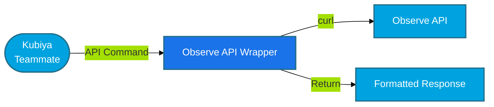

#  Observe API Wrapper for Kubiya

<div align="center">

> 🚀 Direct Observe API operations through Kubiya using curl

[](https://chat.kubiya.ai)
[](https://www.observeinc.com/)
[](https://docs.observeinc.com/)

</div>

## 🎯 Overview

This module provides a direct API wrapper for Observe operations through Kubiya. Built on Docker containers and leveraging the power of the Kubiya platform, this tool enables direct execution of any Observe API operation with full access to all Observe features and capabilities using simple curl commands.

## 🏗️ How It Works



## ✨ Key Features

<table>
<tr>
<td width="50%">

### 🔧 Universal API Access
- Execute any Observe API operation
- Full API functionality
- Direct access to all endpoints
- Real-time API execution

</td>
<td width="50%">

### 🚀 Seamless Integration
- Native API experience
- Command validation
- Error handling
- JSON response formatting

</td>
</tr>
<tr>
<td width="50%">

### 📊 Complete Control
- Dataset management
- Monitor operations
- Dashboard management
- Infrastructure monitoring

</td>
<td width="50%">

### 🔒 Secure Execution
- Containerized environment
- Isolated execution
- API key authentication
- Environment variable support

</td>
</tr>
</table>

## 📋 Prerequisites

<table>
<tr>
<td width="120" align="center">

<br/>Observe
</td>
<td>

- Observe account
- API key and Customer ID
- API access
- Appropriate permissions

</td>
</tr>
<tr>
<td width="120" align="center">

<br/>Docker
</td>
<td>

- Docker runtime
- Container access
- Volume mounts
- Network access

</td>
</tr>
</table>

## 🚀 Quick Start

### 1️⃣ Configure Observe Connection

```bash
export OBSERVE_API_KEY="your-api-token"
export OBSERVE_CUSTOMER_ID="your-customer-id"
export OBSERVE_DATASET_ID="your-dataset-id"
```

**Note:** The API uses Bearer token authentication with the format: `Authorization: Bearer <customerid> <token>`

### 2️⃣ Install Tools

1. Visit [chat.kubiya.ai](https://chat.kubiya.ai)
2. Navigate to teammate settings
3. Install Observe API wrapper source
4. Configure credentials

### 3️⃣ Start Using

Example commands:
```
"datasets list"
"monitors list"
"dashboards list"
"resources list"
"events list"
"query <dataset-id> <oql-query>"
"api GET /v1/datasets"
```

## 📚 High-Performance Commands

### Core Dataset Operations
- **`observe_list_datasets`** - Advanced dataset listing with filtering, pagination, and multiple output formats
- **`observe_opal_query`** - High-performance OPAL queries with smart optimization and caching
- **`observe_query_builder`** - Interactive query builder with templates and validation
- **`observe_dataset_analyzer`** - Deep dataset analysis and performance recommendations  
- **`observe_performance_monitor`** - Real-time performance monitoring and benchmarking

### 🚀 Performance Features
- **Smart Query Optimization** - Automatic limit addition and field selection
- **Advanced Filtering** - Name, type, and content-based filtering
- **Multiple Output Formats** - Table, JSON, CSV, compact, and summary views
- **Intelligent Caching** - Query result caching for repeated operations
- **Performance Monitoring** - Real-time latency tracking and benchmarking
- **Memory Management** - Result limiting and pagination to prevent overwhelming output

## 🔧 Performance-Optimized Examples

### Smart Dataset Listing
```bash
# Basic listing with pagination
observe_list_datasets --limit 20 --output_format table

# Filtered search with compact output
observe_list_datasets --name_filter "kubernetes" --type_filter "logs" --output_format compact

# JSON output for programmatic use
observe_list_datasets --limit 100 --offset 50 --output_format json
```

### High-Performance OPAL Queries
```bash
# Optimized error analysis (auto-limited, cached)
observe_opal_query \
  --dataset_id 41000001 \
  --opal_query "filter level == 'ERROR'" \
  --time_range 1h \
  --output_format table \
  --max_rows 500

# Performance monitoring with caching
observe_opal_query \
  --dataset_id 41000001 \
  --opal_query "filter response_time > 1000 | stats avg(response_time) by endpoint" \
  --time_range 24h \
  --cache_results true \
  --output_format summary

# Security analysis with intelligent formatting
observe_opal_query \
  --dataset_id 41000001 \
  --opal_query "filter action == 'login' and result == 'failed' | top 100 by TIMESTAMP desc" \
  --timeout 30 \
  --output_format csv
```

### Interactive Query Building
```bash
# Pre-built error analysis template
observe_query_builder \
  --query_type error_analysis \
  --dataset_id 41000001 \
  --save_template true

# Security events template
observe_query_builder \
  --query_type security_events \
  --time_range 6h

# Custom query optimization
observe_query_builder \
  --query_type custom \
  --custom_query "filter cpu > 80 | stats max(cpu) by host" \
  --dataset_id 41000001
```

### Dataset Analysis & Optimization
```bash
# Deep dataset analysis with recommendations
observe_dataset_analyzer --dataset_id 41000001

# Performance monitoring with benchmarks
observe_performance_monitor \
  --dataset_id 41000001 \
  --run_benchmark true \
  --save_metrics true
```

### Advanced Use Cases
```bash
# Resource monitoring pipeline
observe_query_builder --query_type resource_usage --dataset_id 41000001 | \
observe_opal_query --dataset_id 41000001 --time_range 2h --cache_results true

# Multi-format data export
observe_opal_query \
  --dataset_id 41000001 \
  --opal_query "pick_col timestamp, level, message | limit 10000" \
  --output_format csv > production_logs_$(date +%Y%m%d).csv
```

## 📊 Advanced URL Parameters

The API wrapper supports all Observe URL parameters for advanced filtering and customization:

### Time Ranges
- `--time-start <timestamp>` - Start time (Unix epoch or ISO 8601)
- `--time-end <timestamp>` - End time (Unix epoch or ISO 8601)  
- `--time-preset <preset>` - Time preset (TODAY, YESTERDAY, PAST_1_HOUR, etc.)

### Filters
- `--filter-eq <column> <value>` - Simple equals filter
- `--filter <column> <operator> <value>` - Advanced filter with operators (=, !=, ~, !~, >, <, >=, <=)

### OPAL Statements
- `--opal <opal-statement>` - Full OPAL statement for complex filtering

### Parameters
- `--param <key> <value>` - Custom parameters for dashboards and worksheets
- `--tab <tab-name>` - Tab selection (resources, logs, related)
- `--dash <dashboard-id>` - Dashboard selection

### Supported Time Presets
- TODAY, YESTERDAY, THIS_DAY_LAST_WEEK
- LAST_WEEK, LAST_MONTH
- PAST_5_MINUTES, PAST_10_MINUTES, PAST_15_MINUTES, PAST_30_MINUTES
- PAST_60_MINUTES, PAST_2_HOURS, PAST_4_HOURS, PAST_6_HOURS
- PAST_12_HOURS, PAST_24_HOURS
- PAST_2_DAYS, PAST_3_DAYS, PAST_4_DAYS, PAST_7_DAYS, PAST_14_DAYS, PAST_30_DAYS

## 📊 Response Format

All API responses include:
- **HTTP Status Code** - Success/error indication
- **Response Time** - Execution duration
- **Formatted JSON** - Pretty-printed response data
- **Error Handling** - Clear error messages

Example response:
```
=== Observe API Operation ===
Command: datasets list
Operation: datasets
Sub-operation: list
Base URL: https://your-customer-id.observeinc.com

Listing datasets...

=== Response ===
HTTP Status: 200
Response Time: 0.5s

✅ Success (200)

{
  "datasets": [
    {
      "id": "dataset-1",
      "name": "Container Logs",
      "description": "Kubernetes container logs"
    }
  ]
}
```

## 🔒 Security

- **API Key Authentication** - Bearer token authentication
- **Environment Variables** - Secure credential storage
- **Container Isolation** - Isolated execution environment
- **No CLI Installation** - No external binary dependencies

## 📚 Learn More

<table>
<tr>
<td width="33%" align="center">

[](https://docs.kubiya.ai)

</td>
<td width="33%" align="center">

[](https://docs.observeinc.com/)

</td>
<td width="33%" align="center">

[](https://slack.observeinc.com/)

</td>
</tr>
</table>

---

<div align="center">

Built with ❤️ by the [Kubiya Community](https://chat.kubiya.ai)


</div> 