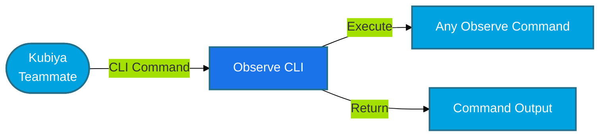

#  Observe CLI Tools for Kubiya

<div align="center">

> 🚀 Direct Observe CLI command execution through Kubiya

[](https://chat.kubiya.ai)
[](https://www.observeinc.com/)
[](https://github.com/observeinc/cli)

</div>

## 🎯 Overview

This module provides a direct CLI wrapper for Observe commands through Kubiya. Built on Docker containers and leveraging the power of the Kubiya platform, this tool enables direct execution of any Observe CLI command with full access to all Observe features and capabilities.

## 🏗️ How It Works



## ✨ Key Features

<table>
<tr>
<td width="50%">

### 🔧 Universal CLI Access
- Execute any Observe CLI command
- Full command-line functionality
- Direct access to all features
- Real-time command execution

</td>
<td width="50%">

### 🚀 Seamless Integration
- Native Observe CLI experience
- Command validation
- Error handling
- Output formatting

</td>
</tr>
<tr>
<td width="50%">

### 📊 Complete Control
- Dataset management
- Monitor operations
- Dashboard management
- Infrastructure monitoring

</td>
<td width="50%">

### 🔒 Secure Execution
- Containerized environment
- Isolated execution
- API key authentication
- Environment variable support

</td>
</tr>
</table>

## 📋 Prerequisites

<table>
<tr>
<td width="120" align="center">

<br/>Observe
</td>
<td>

- Observe account
- API key and Customer ID
- CLI access
- Appropriate permissions

</td>
</tr>
<tr>
<td width="120" align="center">

<br/>Docker
</td>
<td>

- Docker runtime
- Container access
- Volume mounts
- Network access

</td>
</tr>
</table>

## 🚀 Quick Start

### 1️⃣ Configure Observe Connection

```bash
export OBSERVE_API_KEY="your-api-key"
export OBSERVE_CUSTOMER_ID="your-customer-id"
export OBSERVE_DATASET_ID="your-dataset-id"
```

### 2️⃣ Install Tools

1. Visit [chat.kubiya.ai](https://chat.kubiya.ai)
2. Navigate to teammate settings
3. Install Observe CLI tools source
4. Configure credentials

### 3️⃣ Start Using

Example commands:
```
"datasets list"
"monitors list"
"dashboards list"
"resources list"
"events list"
```

## 📚 Available Commands

The Observe CLI wrapper supports all standard Observe CLI commands:

### Dataset Commands
- `datasets list` - List datasets
- `datasets show <dataset-id>` - Show dataset details
- `datasets create` - Create a new dataset
- `datasets update <dataset-id>` - Update a dataset
- `datasets delete <dataset-id>` - Delete a dataset

### Monitor Commands
- `monitors list` - List monitors
- `monitors show <monitor-id>` - Show monitor details
- `monitors create` - Create a new monitor
- `monitors update <monitor-id>` - Update a monitor
- `monitors delete <monitor-id>` - Delete a monitor

### Dashboard Commands
- `dashboards list` - List dashboards
- `dashboards show <dashboard-id>` - Show dashboard details
- `dashboards create` - Create a new dashboard
- `dashboards update <dashboard-id>` - Update a dashboard
- `dashboards delete <dashboard-id>` - Delete a dashboard

### Resource Commands
- `resources list` - List resources
- `resources show <resource-id>` - Show resource details
- `resources create` - Create a new resource
- `resources update <resource-id>` - Update a resource

### Event Commands
- `events list` - List events
- `events show <event-id>` - Show event details
- `events create` - Create a new event

## 📚 Learn More

<table>
<tr>
<td width="33%" align="center">

[](https://docs.kubiya.ai)

</td>
<td width="33%" align="center">

[](https://docs.observeinc.com/)

</td>
<td width="33%" align="center">

[](https://slack.observeinc.com/)

</td>
</tr>
</table>

---

<div align="center">

Built with ❤️ by the [Kubiya Community](https://chat.kubiya.ai)


</div> 